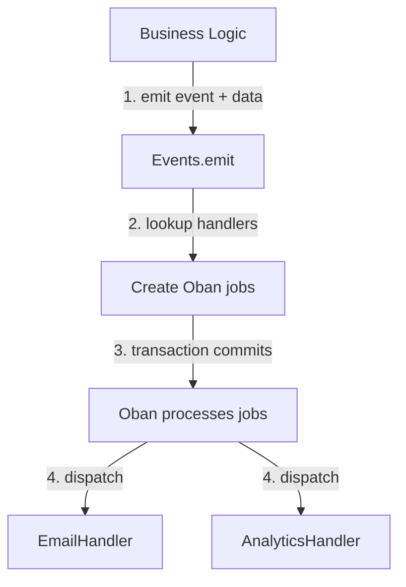

# ObanEvents

A lightweight, persistent event bus for Elixir applications built on top of [Oban](https://github.com/sorentwo/oban).

## Features

- 🔒 **Persistent** - Events survive application restarts (stored in Oban's database)
- 🔄 **Reliable** - Automatic retries on failure via Oban
- ⚡ **Async** - Non-blocking execution of handlers
- 🔗 **Transactional** - Works within database transactions for atomicity
- 📊 **Observable** - Track event processing via Oban Web UI
- 🏷️ **Traceable** - Every event carries an id, an emit time and custom metadata
- ✅ **Type-safe** - Compile-time validation of events
- 🎯 **Decoupled** - Event emitters don't know about handlers
- 🧪 **Testable** - Assertion and handler helpers in `ObanEvents.Testing`

## Installation

Add `oban_events` to your list of dependencies in `mix.exs`:

```elixir
def deps do
  [
    {:oban_events, "~> 0.1.0"},
    {:oban, "~> 2.0"},
    {:postgrex, ">= 0.0.0"}  # Required by Oban
  ]
end
```

## Quick Start

### 1. Define Your Event Bus

Create a module that uses `ObanEvents` and define your events and handlers:

```elixir
defmodule MyApp.Events do
  use ObanEvents,
    oban: MyApp.Oban,
    queue: :myapp_events,
    max_attempts: 3,
    priority: 2

  @event_handlers %{
    user_created: [MyApp.EmailHandler, MyApp.AnalyticsHandler],
    user_updated: [MyApp.CacheHandler],
    order_placed: [MyApp.NotificationHandler]
  }
end
```

### 2. Create Event Handlers

Implement the `ObanEvents.Handler` behaviour:

```elixir
defmodule MyApp.EmailHandler do
  use ObanEvents.Handler

  require Logger

  @impl true
  def handle_event(:user_created, data) do
    %{"user_id" => user_id, "email" => email} = data

    Logger.info("Sending welcome email to #{email}")
    MyApp.Mailer.send_welcome_email(email)

    :ok
  end

  @impl true
  def handle_event(_event, _data), do: :ok
end
```

### 3. Emit Events

Emit events from your application code, preferably within transactions:

```elixir
defmodule MyApp.Accounts do
  alias MyApp.{Repo, Events}

  def create_user(attrs) do
    Repo.transaction(fn ->
      with {:ok, user} <- Repo.insert(changeset),
           {:ok, _jobs} <- Events.emit(:user_created, %{
             user_id: user.id,
             email: user.email
           }) do
        {:ok, user}
      end
    end)
  end
end
```

## How It Works



## Configuration Options

When using `ObanEvents`, you can configure:

- `:oban` - Oban instance module (default: `Oban`)
- `:queue` - Oban queue name (default: `:events`)
- `:max_attempts` - Maximum retry attempts (default: `3`)
- `:priority` - Job priority, 0-3, lower is higher priority (default: `2`)

```elixir
defmodule MyApp.Events do
  use ObanEvents,
    oban: MyApp.Oban,           # Use custom Oban instance
    queue: :my_events,          # Custom queue name
    max_attempts: 5,            # Retry up to 5 times
    priority: 1                 # Higher priority than default

  @event_handlers %{
    # ...
  }
end
```

## API

Your event bus module provides these functions:

### `emit/2`

Emit an event to all registered handlers.

```elixir
@spec emit(atom(), map()) :: {:ok, [Oban.Job.t()]}

# Raises ArgumentError if event is not registered
MyApp.Events.emit(:user_created, %{user_id: 123, email: "user@example.com"})
```

### `emit/3`

Emit an event with metadata attached.

```elixir
@spec emit(atom(), map(), keyword()) :: {:ok, [Oban.Job.t()]}

MyApp.Events.emit(:user_created, %{user_id: 123}, meta: %{actor_id: 7})
```

Options:

- `:meta` - metadata map carried alongside the payload (default: `%{}`)
- `:id` - unique event id (default: a generated UUID)
- `:emitted_at` - `DateTime` the event was emitted (default: `DateTime.utc_now/0`)

### `get_handlers!/1`

Get all handlers registered for an event.

```elixir
@spec get_handlers!(atom()) :: [module()]

MyApp.Events.get_handlers!(:user_created)
# => [MyApp.EmailHandler, MyApp.AnalyticsHandler]
```

### `all_events/0`

List all registered event names.

```elixir
@spec all_events() :: [atom()]

MyApp.Events.all_events()
# => [:user_created, :user_updated, :order_placed]
```

### `registered?/1`

Check if an event is registered.

```elixir
@spec registered?(atom()) :: boolean()

MyApp.Events.registered?(:user_created)
# => true
```

## Event Metadata

Beyond its payload, every event carries metadata: a unique id shared by all of
its handler jobs, the time it was emitted, and anything passed as `:meta`.

```elixir
MyApp.Events.emit(:user_created, %{user_id: user.id},
  meta: %{actor_id: actor.id, request_id: request_id}
)
```

Handlers that need the metadata implement `handle_event/3`, which receives an
`ObanEvents.Event` struct as the third argument:

```elixir
defmodule MyApp.AuditHandler do
  use ObanEvents.Handler

  @impl true
  def handle_event(name, data, %ObanEvents.Event{} = event) do
    MyApp.Audit.record(name, data,
      event_id: event.id,
      actor_id: event.meta["actor_id"],
      emitted_at: event.emitted_at
    )
  end
end
```

The struct carries:

- `:id` - unique event id, shared by every handler job of the same emit
- `:name` - event name
- `:data` - payload, with string keys
- `:meta` - metadata passed to `emit/3`, with string keys
- `:handler` - handler module the event is being dispatched to
- `:emitted_at` - `DateTime` the event was emitted, not when it is processed
- `:job_id`, `:attempt`, `:max_attempts` - Oban job details of the current run

Notes:

- A handler implements either `handle_event/2` or `handle_event/3`. When both
  are defined, `handle_event/3` is used.
- Metadata is stored in the job args, so it must be JSON-serializable and stays
  small. Use it for tracing (actor, request id, correlation id), not for payload.
- Jobs that were enqueued before metadata existed still run. Their event `id` is
  `nil`, `meta` is empty and `emitted_at` falls back to the job's insert time.

## Handler Implementation

Handlers must implement the `handle_event/2` callback, or `handle_event/3` to
also receive the [event metadata](#event-metadata):

```elixir
defmodule MyApp.AnalyticsHandler do
  use ObanEvents.Handler

  @impl true
  def handle_event(:user_created, data) do
    %{"user_id" => user_id} = data
    MyApp.Analytics.track("User Created", user_id: user_id)
    :ok
  end

  @impl true
  def handle_event(:user_updated, data) do
    %{"user_id" => user_id, "changes" => changes} = data
    MyApp.Analytics.track("User Updated", user_id: user_id, changes: changes)
    :ok
  end

  # Ignore other events
  @impl true
  def handle_event(_event, _data), do: :ok
end
```

### Return Values

Handlers should return:

- `:ok` - Event processed successfully
- `{:ok, result}` - Event processed successfully with a result
- `{:error, reason}` - Event processing failed (will trigger Oban retry)

Handlers may also raise exceptions, which will trigger Oban's retry mechanism.

## Best Practices

### 1. Always Use Transactions

Emit events within transactions to ensure atomicity:

```elixir
Repo.transaction(fn ->
  with {:ok, user} <- Repo.insert(changeset),
       {:ok, _jobs} <- Events.emit(:user_created, %{user_id: user.id}) do
    {:ok, user}
  end
end)
# If insert fails, emit never happens ✅
# If emit fails, transaction rolls back ✅
```

### 2. Make Handlers Idempotent

Handlers may be retried. Design them to be safe to run multiple times:

```elixir
def handle_event(:user_created, %{"user_id" => user_id}) do
  # Use upsert instead of insert to handle retries
  %UserProfile{user_id: user_id}
  |> Repo.insert(
    on_conflict: :nothing,
    conflict_target: :user_id
  )

  :ok
end
```

### 3. Include All Necessary Data

Don't rely on database lookups for data that might change:

```elixir
# Good: Include all data needed
Events.emit(:status_changed, %{
  record_id: record.id,
  old_status: old_status,
  new_status: record.status
})

# Bad: Handler has to query DB (old_status might be wrong)
Events.emit(:status_changed, %{
  record_id: record.id
})
```

### 4. Use JSON-Serializable Data

Event data must be JSON-serializable (no PIDs, refs, or functions):

```elixir
# Good
Events.emit(:user_created, %{
  user_id: user.id,
  email: user.email,
  amount: Decimal.to_string(user.balance)
})

# Bad: Full struct is not reliably serializable
Events.emit(:user_created, %{user: user})
```

### 5. Pattern Match on Specific Events

Only handle events you care about:

```elixir
def handle_event(:user_created, data), do: # handle
def handle_event(:user_updated, data), do: # handle
def handle_event(_other, _data), do: :ok  # ignore rest
```

### 6. Return Errors for Retriable Failures

```elixir
def handle_event(:send_notification, data) do
  case NotificationService.send(data) do
    {:ok, _} -> :ok
    {:error, :rate_limited} -> {:error, :rate_limited}  # Will retry
    {:error, :invalid_data} -> :ok  # Don't retry invalid data
  end
end
```

## Handler Management

### Renaming Handler Modules

Handler module names are serialized to the database as fully-qualified Elixir module atoms (e.g., `"Elixir.MyApp.EmailHandler"`). When you rename a handler module, existing queued jobs will still reference the old module name and will fail when Oban tries to execute them.

**Safe Renaming Strategy:**

Use a module alias to maintain backward compatibility:

```elixir
# After renaming MyApp.EmailHandler to MyApp.Notifications.EmailHandler

# 1. Create the new module with your desired name
defmodule MyApp.Notifications.EmailHandler do
  use ObanEvents.Handler

  @impl true
  def handle_event(:user_created, data) do
    # Your handler logic
    :ok
  end
end

# 2. Keep the old module as an alias
defmodule MyApp.EmailHandler do
  @moduledoc false
  defdelegate handle_event(event, data), to: MyApp.Notifications.EmailHandler
end

# 3. Update your event registry to use the new name
defmodule MyApp.Events do
  use ObanEvents

  @event_handlers %{
    user_created: [
      MyApp.Notifications.EmailHandler  # New jobs use new name
    ]
  }
end
```

**How This Works:**

1. **Existing queued jobs** call `MyApp.EmailHandler.handle_event/2`, which delegates to the new module
2. **New jobs** are created with `MyApp.Notifications.EmailHandler`
3. **Zero downtime** - both old and new jobs work correctly

**Cleanup:**

After all old jobs have processed (check Oban Web UI), you can safely remove the alias module. This typically takes as long as your retry window (default: a few hours with exponential backoff).

## Testing

`ObanEvents.Testing` provides helpers for both sides of the bus. Add them to
your test case with the same options you would pass to `Oban.Testing`:

```elixir
defmodule MyApp.AccountsTest do
  use ExUnit.Case, async: true
  use ObanEvents.Testing, repo: MyApp.Repo
end
```

This also does `use Oban.Testing`, so `assert_enqueued/1`, `all_enqueued/1` and
`perform_job/3` stay available for anything the event helpers don't cover.

### Testing Event Emission

`assert_event_emitted/2` and `refute_event_emitted/2` match on the fields you
pass, and ignore the rest:

```elixir
test "emits user_created event" do
  {:ok, user} = Accounts.create_user(%{email: "test@example.com"})

  assert_event_emitted(:user_created)

  assert_event_emitted(:user_created,
    handler: MyApp.EmailHandler,
    data: %{user_id: user.id},
    meta: %{actor_id: 7}
  )

  refute_event_emitted(:user_deleted)
end
```

Use `emitted_events/1` to assert on generated metadata, such as the id shared by
all handler jobs of one emit:

```elixir
test "emits one event for both handlers" do
  {:ok, _user} = Accounts.create_user(%{email: "test@example.com"})

  assert [event_one, event_two] = emitted_events()

  assert event_one.name == :user_created
  assert event_one.id == event_two.id
end
```

### Testing Handlers

`perform_event/4` runs a handler through `ObanEvents.DispatchWorker`, the same
way Oban does in production, including the metadata it receives:

```elixir
test "EmailHandler sends welcome email" do
  data = %{"user_id" => 123, "email" => "test@example.com"}

  assert :ok = perform_event(MyApp.EmailHandler, :user_created, data)
  assert_email_sent(to: "test@example.com", subject: "Welcome!")
end

test "AuditHandler records the actor" do
  assert :ok =
           perform_event(MyApp.AuditHandler, :user_created, %{user_id: 123},
             meta: %{actor_id: 7},
             attempt: 2
           )
end
```

For handlers called directly, `build_event/3` builds the `ObanEvents.Event`
struct that `handle_event/3` expects:

```elixir
test "AuditHandler records the event id" do
  event = build_event(:user_created, %{user_id: 123}, meta: %{actor_id: 7})

  assert :ok = MyApp.AuditHandler.handle_event(event.name, event.data, event)

  assert [audit] = MyApp.Audit.all()
  assert audit.event_id == event.id
end
```

### Testing with Oban Inline Mode

For integration tests, configure Oban to execute jobs inline:

```elixir
# config/test.exs
config :my_app, Oban,
  testing: :inline,
  queues: false,
  plugins: false

# In test
test "creates user and sends email" do
  {:ok, user} = Accounts.create_user(%{email: "test@example.com"})

  # Email sent immediately in test mode
  assert_email_sent(to: "test@example.com")
end
```

## Observability

### Oban Web UI

View event processing history, errors, and retries:

```elixir
# In router.ex (development only)
import Phoenix.LiveDashboard.Router

scope "/dev" do
  pipe_through :browser
  live_dashboard "/dashboard", metrics: MyAppWeb.Telemetry

  forward "/oban", Oban.Web.Router
end
```

### Logging

ObanEvents logs all event processing. Log lines carry the event id and the Oban
job id, so a single emit can be traced across its handlers:

```
[info] Processing event: user_created with handler: MyApp.EmailHandler (event_id=fdc1..., job_id=42, attempt=1)
[info] Event processed successfully: user_created by MyApp.EmailHandler (event_id=fdc1..., job_id=42, attempt=1)
[error] Event handler failed: user_created by MyApp.EmailHandler, error: :network_timeout (event_id=fdc1..., job_id=43, attempt=1)
```

## Troubleshooting

### Events Not Processing

**Check Oban queue configuration:**

```elixir
# config/config.exs
config :my_app, Oban,
  repo: MyApp.Repo,
  queues: [
    events: 10  # Make sure your queue is configured
  ]
```

**Check job status in database:**

```sql
SELECT * FROM oban_jobs
WHERE queue = 'events'
ORDER BY inserted_at DESC
LIMIT 10;
```

**Find every handler job of a single event:**

```sql
SELECT args->>'handler', state, errors FROM oban_jobs
WHERE args->>'event_id' = 'fdc1c0ba-8e2d-4b2c-9a02-2b0b3a2f4c1e';
```

### Events Not Emitted

**Verify event is registered:**

```elixir
iex> MyApp.Events.registered?(:user_created)
true

iex> MyApp.Events.all_events()
[:user_created, :user_updated, ...]
```

**Check transaction succeeded:**

Add logging to verify the transaction completes:

```elixir
Repo.transaction(fn ->
  with {:ok, user} <- Repo.insert(changeset),
       {:ok, jobs} <- Events.emit(:user_created, data) do
    Logger.info("Emitted #{length(jobs)} jobs")
    {:ok, user}
  end
end)
```

### Handler Failures

**View errors in Oban Web UI** at `/dev/oban`

**Check application logs** for handler errors

**Manually retry failed job:**

```elixir
iex> job = Oban.Job |> Repo.get(job_id)
iex> Oban.retry_job(job)
```

## Examples

See the [test suite](test/) for complete examples of:
- Event emission
- Event metadata
- Handler implementation
- Transaction behavior
- Testing patterns

## License

MIT License - see [LICENSE](LICENSE) for details.

## Credits

Built with [Oban](https://github.com/sorentwo/oban) by Parker Selbert.
